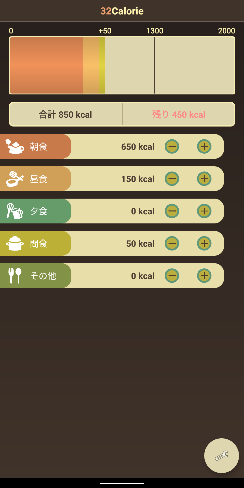
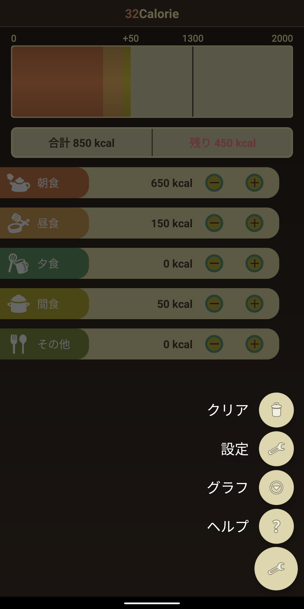
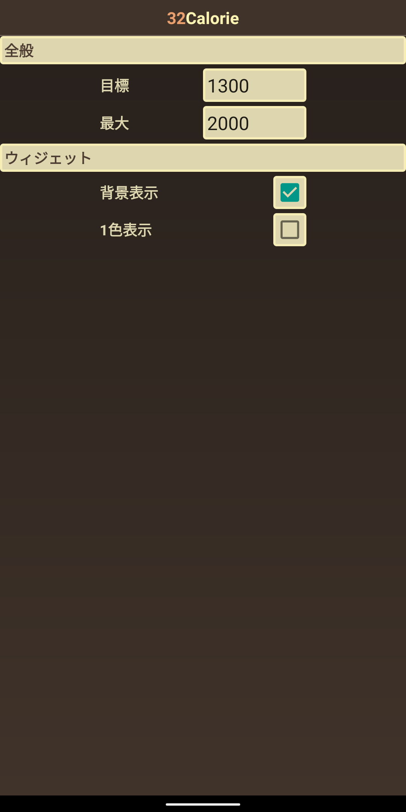
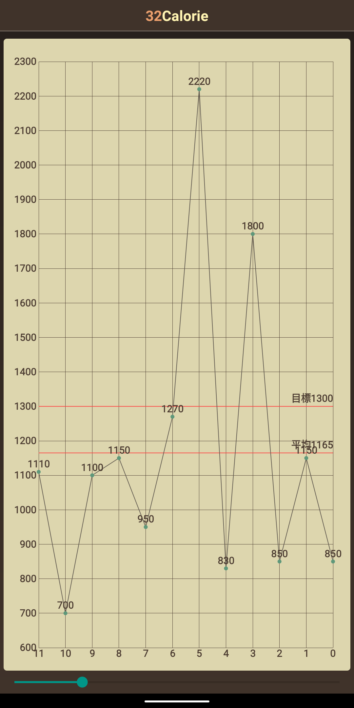
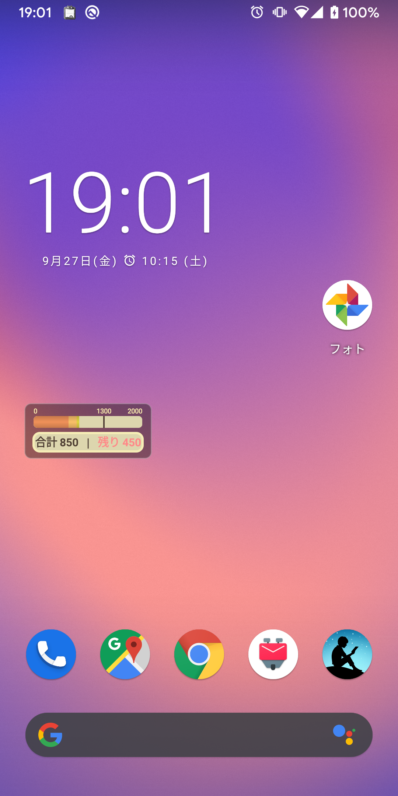

# 32Calorie
## 説明
32Calorieは一日の摂取カロリーを簡単に記録できるシンプルなアプリです。  

例えば朝食に500Kカロリーを摂取した場合、「朝食」の「+」を押し続けてバーが500に到達したら指を離すだけで記録できます。  

32Calorieのウィジェットをホーム画面に設置することもできます。  
(1) ホーム画面を長押しします  
(2) ウィジェットを選択します  
(3) 32Calorieを選択します  

## スクリーンショット

|メイン|メニュー|設定|グラフ|ウィジェット|
|--|--|--|--|--|
||||||
